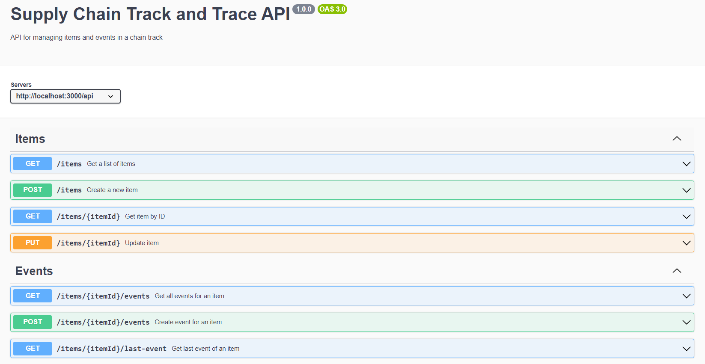

# Supply Chain Track & Trace System API

This API backend app is responsible for handling endpoints related to supply chain items and events. It provides functionalities such as creating new items, querying all items, getting a specific item by ID, updating item reference data, adding events to an item, querying all events of an item, and retrieving the last event of an item. These APIs enable users to manage and track supply chain items and their associated events. The controller ensures validation of input data and interacts with the database using the TypeORM library. Overall, it facilitates efficient management and monitoring of supply chain activities.

## Views

  

## Technologies Used

- Node.js
- TypeScript
- Express.js
- PostgreSQL
- TypeORM

## Getting Started

#### Prerequisites

- Node.js (v14 or higher)
- PostgreSQL

#### Installation

1. Clone the repository: `git clone git@github.com:rOluochKe/supply-chain-api.git`
2. Run docker build: `docker-compose up --build`
3. Start API run: `docker-compose up`
4. Stop docker: `docker-compose down`
The API will be available at `http://localhost:4000/api`.

## API Endpoints

- `POST /items` - Create a new supply chain item
- `GET /items` - Retrieve all items
- `GET /items/:itemId` - Retrieve a specific item by ID
- `PUT /items/:itemId` - Update an item's reference data
- `POST /items/:itemId/events` - Add a new event to an item
- `GET /items/:itemId/events` - Retrieve all events of an item
- `GET /items/:itemId/events/last-event` - Retrieve the last event of an item

For detailed request and response information, please refer to the API documentation `http://localhost:4000/api-docs`.
